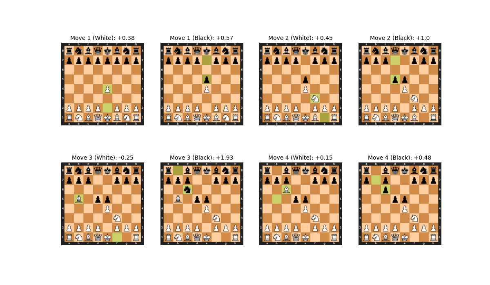
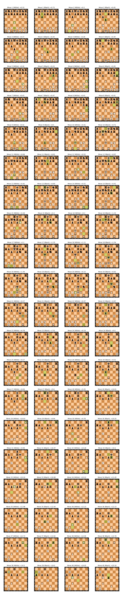

## Sample Simulated Game

Image of chess game opening involving the CNN position evaluator playing itself. It makes moves using a minmax algorithm leveraging the CNN to analyze possible positions. The game features an interesting, aggressive variation of the Elephant gambit. 
 

 
 
Image of chess game between two Stockfish engines: white has depth 16 search, while black has depth 4. 
 

